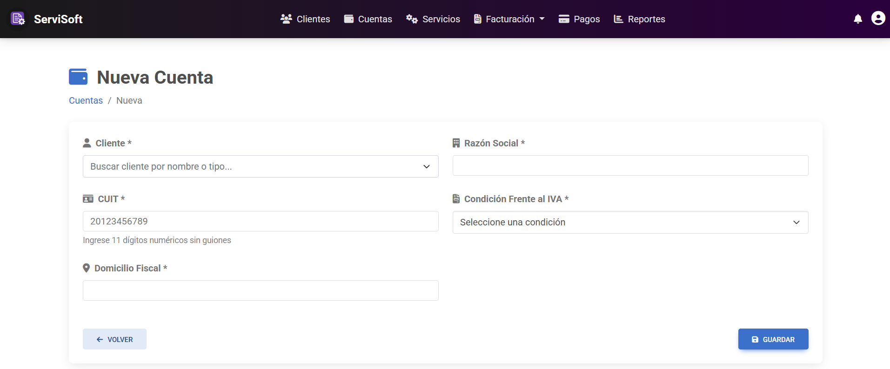

---

# Alta de Cuenta

*   **ID:** GC-001.
*   **Descripción:** En este caso de uso, el *administrador* ingresa los datos necesarios y selecciona un **Cliente previamente registrado** para realizar el alta de una nueva cuenta. 
*   **Actor(es):** *Administrador*.

## Precondiciones
* El cliente al cual se asociará la nueva cuenta debe haber sido registrado previamente en el sistema.

## Flujo principal de eventos
1. El administrador, estando en la página inicial con el listado, selecciona la opción **+ Nueva cuenta**.
2. El sistema redirige a una nueva página que le permite ingresar los datos que componen a la nueva cuenta.
3. El administrador selecciona o busca un cliente registrado en la opción **Cliente**, luego ingresa por teclado la razón social, el CUIT y domicilio fiscal que tendrá la nueva cuenta.
4. El administrador selecciona la condición frente al IVA de la cuenta.
5. Tras haber llenado los campos del formulario, el administrador pulsa el botón **Guardar**.
6. El sistema valida que los datos ingresados sean válidos y que no haya campos vacíos.
7. El sistema, tras haber validado los datos, muestra un mensaje de confirmación indicando que la cuenta fue creada exitosamente.
8. Se termina el caso de uso.

## Flujos alternativos
*   **Si hay campos faltantes o con errores:**
    * El sistema avisa al administrador mediante una notificación emergente debajo del campo incorrecto o faltante.
    * El administrador completa el campo faltante o lo corrige.
    * Se regresa al paso 6 de la secuencia normal.

## Poscondiciones
* Se crea el registro de una nueva cuenta en el sistema.