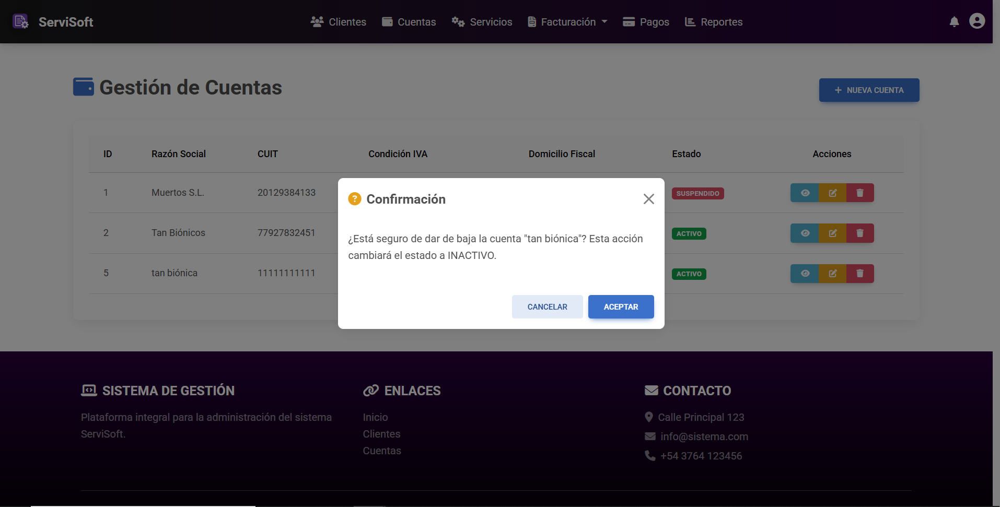

---

# Baja de Cuenta

*   **ID:** GC-002.
*   **Descripción:** En este caso de uso, el *administrador* solicita al sistema la baja de una cuenta ya existente.
*   **Actor(es):** *Administrador*.

## Precondiciones
* La cuenta que se quiere dar de baja debe haber sido registrada previamente.

## Flujo principal de eventos
1. El administrador, estando en la página inicial con el listado, se situa sobre una de las cuentas listadas y pulsa en el botón con forma de **Basurero** para dar de baja (marcar como *inactivo*).
2. El sistema muestra en un mensaje emergente la razón social de la cuenta a dar de baja y solicita confirmación antes de continuar con el cambio de estado.
3. El administrador, tras confirmar que el nombre de la cuenta es correcto, presiona en el botón **Confirmar**.
4. El sistema cambia el estado de la cuenta a **Inactiva** para que deje de recibir nuevas facturas y dejar de ser incluida en los nuevos reportes. 
5. El sistema recarga la página del listado, dónde no se visualizan las cuentas en estado **Inactivo**.
6. Se termina el caso de uso.

## Flujos alternativos
*   **Si el administrador presiona el botón Cancelar**
    * El sistema no cambia el estado de la cuenta y regresa al listado.
    * Se termina el caso de uso.

## Poscondiciones
* Se cambia el estado a **Inactivo** de una cuenta seleccionada.