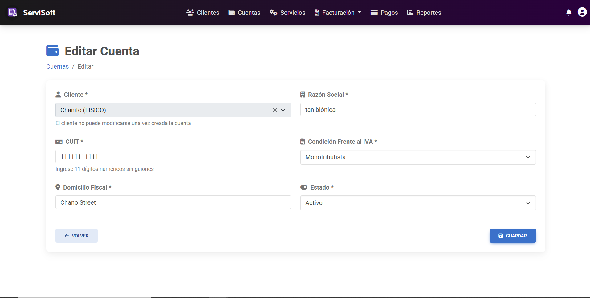

---

# Editar Cuenta

*   **ID:** GC-003.
*   **Descripción:** En este caso de uso, el *administrador* solicita al sistema modificar uno o varios campos de una cuenta, para mantener actualizada su información.
*   **Actor(es):** *Administrador*.

## Precondiciones
* La cuenta a modificar debe haber sido previamente creada.

## Flujo principal de eventos
1. El administrador, estando en la página inicial con el listado, se situa sobre una de las cuentas listadas y pulsa en el botón con forma de **Lápiz** para modificar uno o varios campos de una cuenta específica.
2. El sistema redirige a la página de *Edición* dónde permite modificar los campos: razón social, CUIT, condición frente al IVA, domicilio fiscal y estado.
3. El administrador modifica el o los campos que considere deban ser actualizados y presiona en el botón **Guardar**.
4. El sistema valida que los nuevos datos ingresados sean válidos y que no haya campos vacíos.
5. El sistema cambia los atributos de la cuenta alterada y regresa a la página incial del listado de cuentas, dónde se pueden ver los cambios recientes.
6. Se termina el caso de uso.

## Flujos alternativos
*   **Si hay campos faltantes o con errores:**
    * El sistema avisa al administrador mediante una notificación emergente debajo del campo incorrecto o faltante.
    * El administrador completa el campo faltante o lo corrige.
    * Se regresa al paso 4 de la secuencia normal.

## Poscondiciones
* Se modifica el registro de una cuenta específica en el sistema.