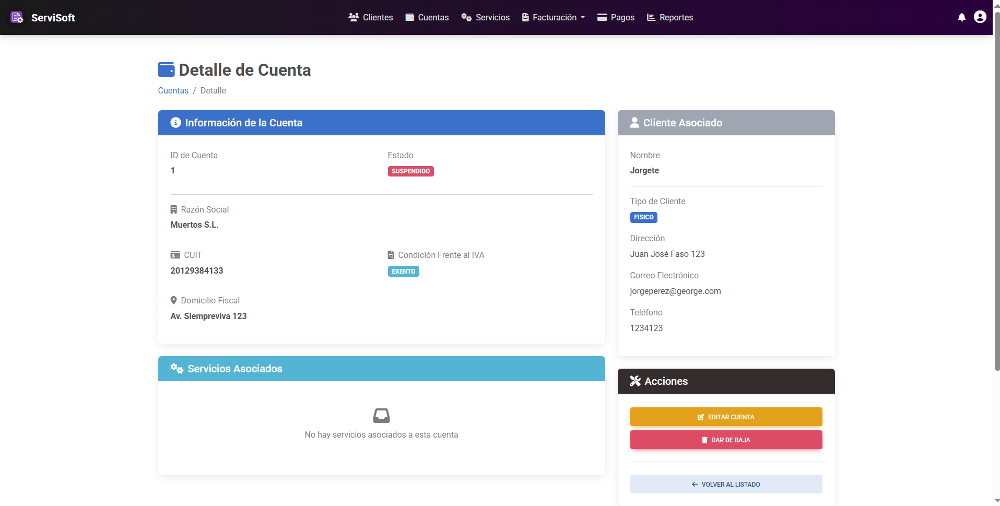

---

# Ver Detalle

*   **ID:** GC-004.
*   **Descripción:** En este caso de uso, el *administrador* solicita al sistema ver a detalle la información de una cuenta específica.
*   **Actor(es):** *Administrador*.

## Precondiciones
* La cuenta a visualizar debe existir en el sistema.
* La cuenta a visualizar debe tener los estados: **ACTIVA** o **SUSPENDIDO**.

## Flujo principal de eventos
1. El administrador, estando en la página inicial con el listado, se situa sobre una de las cuentas listadas y pulsa en el botón con forma de **Ojo** para acceder a la información específica de dicha cuenta.
2. El sistema redirige a la página de *Detalle de Cuenta* dónde se muestra: información de la cuenta (datos ingresados al momento de la creación), información del cliente asociado a la cuenta y un listado de los servicios activos que posee la cuenta.
3. El sistema permite que el administrador *Modifique* o *De de baja* la cuenta que está visualizando mediante los respectivos botones: **EDITAR CUENTA** y **DAR DE BAJA**.
4. El sistema ofrece la posibilidad de regresar al listado inicial mediante el botón **VOLVER AL LISTADO**.
5. Se termina el caso de uso.

## Flujos alternativos
*   **Si se presiona el botón para editar cuenta**
    * El sistema redirige a la página de edición de la cuenta que se estaba visualizando previamente.
    * Ver caso de uso: [Editar Cuenta](CU_Editar Cuenta_GC-003.md)
*   **Si se presiona el botón para dar de baja**
    * Ver caso de uso: [Baja de Cuenta](CU_Baja de Cuenta_ GC-002.md)